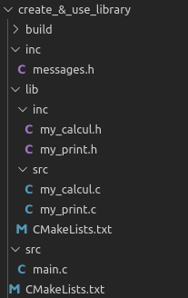

# Create and Use Your Own Library
- 

## Requirements
- CMake
    - for ubuntu:sudo apt-get install cmake
    - https://cmake.org/download/
    - minimum version required for this repo: 3.10.2
- GNU Make
    - minimum version required: 4.1

## Compile & Run
- Build:
    - Create /build directory
    - Get in build (cd build/)
    - Type 'cmake ..' to create Makefile
    - Type 'make' to build
    - mylib library and executable will be generated under build directory
- Run:
    - ./create_and_use_lib

## Working Principle
When it starts running, 
- It prints out to stdout as seen below:  

**** Create and Use Your Own Library ****
MSG1:MESSAGE_1_  
MSG2:MESSAGE_2_  
mylib_print:MESSAGE_1_  
mylib_print:MESSAGE_2_  
3+2=5  

